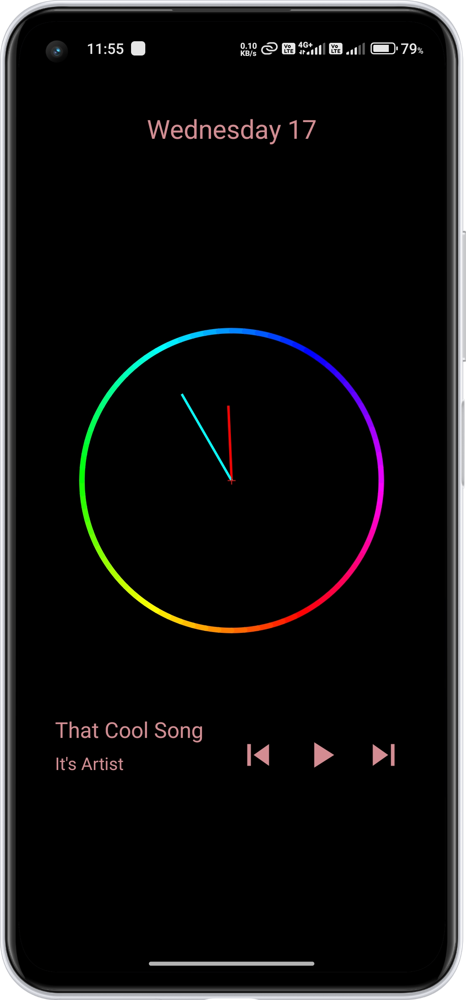

# Clock with Music Info

This project is a Compose application that displays a clock with music information. It includes an animated clock and a simple music player interface with song information and control buttons.

## Features

- **Current Date Display**: Shows the current day and date.
- **Animated Clock**: Displays an animated clock with hour and minute hands.
- **Music Player Interface**: Includes play/pause, next, and previous buttons.
- **Song Information**: Displays the current song's title and artist.

## Screenshots


*Description: The main screen displaying the animated clock and the current date.*

## Screenshots


*Description: The screen showing the music player interface with song information and control buttons.*

## Video Demonstration


https://github.com/user-attachments/assets/4fc9f788-4831-4c36-aece-bbcd0f827778


## How to Run

1. **Clone the repository**:
    ```sh
    git clone https://github.com/yourusername/ClockWithMusicInfo.git
    ```

2. **Open the project**:
    - Open the project in Android Studio.

3. **Build and run**:
    - Build and run the project on an emulator or physical device.

## Dependencies

- **Kotlin**: As the programming language.
- **Jetpack Compose**: Making UI Animation

## Code Structure

- **MainActivity.kt**: The main entry point of the application.
- **Clock.kt**: Contains the Composable functions for displaying the clock and music information.

## Usage

- The app displays the current date at the top.
- The animated clock shows the current time with hour and minute hands.
- The music player interface at the bottom includes buttons for previous, play/pause, and next actions. Song title and artist information are displayed above the buttons.


## Contributing

1. Fork the repository.
2. Create your feature branch (`git checkout -b feature/your-feature`).
3. Commit your changes (`git commit -m 'Add some feature'`).
4. Push to the branch (`git push origin feature/your-feature`).
5. Open a pull request.

## Contact

If you have any questions or suggestions, feel free to reach out:

- **Email**: prakashom8873@gmail.com
- **GitHub**: [om993139](https://github.com/om993139)

